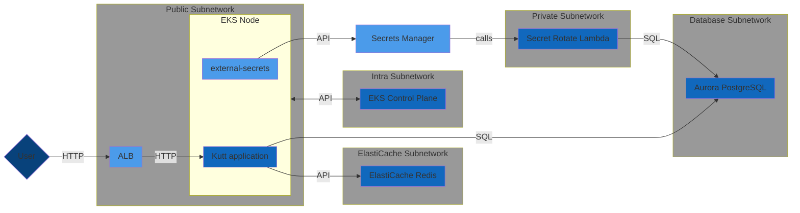

# terraform-eks-kutt-demo

This project is based on <https://github.com/dex4er/terraform-eks-flux-demo>
project which provides a very basic EKS cluster:

- has nodes in a public or private network with ELB endpoints in a public
  network and master nodes in an intra network
- encrypted at rest
- has customized nodes in a self-managed node group
- has enabled autoscaler and AWS load balancer controller
- exposes hello-world application

The demo uses <https://github.com/terraform-aws-modules> modules. All modules and
resources and in main directory to make modifications easier so this project can
be easily used as a base for other demos and experiments.

The project can be run locally or with Terraform Cloud or with Spacelift.

This instruction describes how to run the project locally with the local state.

## Architecture



## Prerequisities

### AWS account

If you don't use SSO then I recommend creating an IAM user with
`AdministratorAccess` permissions.

1. Go to <https://us-east-1.console.aws.amazon.com/iamv2/home?region=eu-central-1#/users>
2. `[Add users]`
3. User name: admin
4. Attach policies directly: AdministratorAccess
5. `[Next]`
6. `[Create user]`
7. Write down an ARN of the user: it might be like `arn:aws:iam::123456789012:user/admin`

Create an access key for this user:

1. Go to <https://us-east-1.console.aws.amazon.com/iamv2/home#/users/details/admin?section=security_credentials>
2. `[Create access key]`
3. `(*) Application running outside AWS`
4. `[Next]`
5. `[Create access key]`
6. `[Download .csv file]` or copy-paste separate fields somewhere securely or
   use it with `granted credentials add` command as later is described.

The Terraform should be able to assume the dedicated role.

1. Go to <https://us-east-1.console.aws.amazon.com/iamv2/home?region=eu-central-1#/roles>
2. `[Create role]`
3. Custom trust policy:

```json
{
  "Version": "2012-10-17",
  "Statement": [
    {
      "Sid": "AllowAssumeRole",
      "Effect": "Allow",
      "Principal": {
        "AWS": [
          "arn:aws:iam::123456789012:root",
          "arn:aws:iam::123456789012:user/admin"
        ]
      },
      "Action": "sts:AssumeRole"
    }
  ]
}
```

1. `[Next]`
2. Add permissions: AdministratorAccess
3. `[Next]`
4. Role name: Admin
5. `[Create role]`
6. Write down an ARN of the role: it might be like `arn:aws:iam::123456789012:role/Admin`

### asdf

All required tools can be installed with <https://asdf-vm.com/>:

```sh
git clone https://github.com/asdf-vm/asdf.git ~/.asdf --branch v0.11.2
. "$HOME/.asdf/asdf.sh"
while read plugin version; do asdf plugin add $plugin || test $? = 2; done < .tool-versions
asdf install
```

Additionally, I recommend using https://granted.dev/ for switching between AWS accounts:

```sh
asdf plugin add granted
asdf install granted latest
asdf global granted latest
```

then `~/.aws/config` might be:

```ini
[profile dex4er]
output             = json
region             = eu-central-1
credential_process = granted credential-process --profile=dex4er
```

and credentials can be added with the command:

```sh
granted credentials add
```

```console
? Profile Name: dex4er
? Access Key ID: XXXXXXXXX
? Secret Sccess Key: *****************
Saved dex4er to secure storage
```

You can switch to your profile:

```sh
assume dex4er
```

## Usage

- Check current context:

```sh
aws sts get-caller-identity
```

- Check what AZs are available:

```sh
aws ec2 describe-availability-zones --region $AWS_REGION --query 'AvailabilityZones[*].ZoneId'
```

- Create `terraform.tfvars` file, ie.:

```tf
account_id                = "123456789012"
admin_role_arns           = ["arn:aws:iam::123456789012:role/Admin"]
admin_user_arns           = ["arn:aws:iam::123456789012:user/admin"]
assume_role               = "arn:aws:iam::123456789012:role/Admin"
azs                       = ["euc-az1", "euc-az2", "euc-az3"]
name                      = "challenge-dex4er"
region                    = "eu-central-1"
```

- Run Terraform:

```sh
terraform init
terraform apply
```

- Connect to the cluster:

```sh
terraform output
# check for cluster_update_kubeconfig_command and run the command, ie.:
aws eks update-kubeconfig --name terraform-eks-kutt-demo --region eu-central-1 --role arn:aws:iam::123456789012:role/Admin
```

- Connect to ingress:

```sh
kubectl get ingress -n kutt
curl http://$ADDRESS
```

## Shutdown

Workloads in the cluster must be removed in the correct order to prevent leaving
orphaned resources:

1. Stopping Flux updates.
2. Removing all kustomizations except AWS resource controllers and Flux "all"
   kustomization.
3. Removing AWS resource controllers.
4. Uninstalling Flux.

It should happen during destroying of `null_resource`.flux_kustomization_all`.

## Note

EKS cluster should be created from the session run in a dedicated role. Such a
user or role is a super user for the cluster and this parameter is invisible in
a panel or API and can't be changed later. It is better to use `assume_role`
variable to switch Terraform to such a role rather than to use AWS user or root
account. `caller_identity` output is presented for verification if the correct
role is assumed.

EKS cluster nodes will be created with public IPs to save the cost of NAT
servers and service endpoints. It might be switched to private IPs with
`cluster_in_private_subnet` variable.

The demo avoids Kubernetes Provider as it leads to many problems when the
cluster is not available or about to replace or destroy. `local-exec` is used
instead as an experiment if it is possible to communicate with Kubernetes
without a provider. Unfortunately, it is problematic to use additional tools in
Terraform Cloud runs so a current solution is suboptimal: it installs each copy
of an external tool separately for each `null_resource`. It might be changed to
the shared directory with `asdf_dir` variable when it is possible to run
pre-apply commands (ie. Gitlab CI, GitHub Actions, Spacelift, etc.) or Terraform
is run locally.

## Terraform Cloud

The project is ready to use with the Terraform Cloud. In this case, after the
state will is no longer local and might be used by more developers.

In this case the workspace should have Execution Mode: Remote. All variables from
`terraform.tfvars` file should be added as "Workspace variables" (note: arrays
should be added as HCL). Additionally environment variable `AWS_REGION` should
be added too.

Variables for AWS API (`AWS_ACCESS_KEY_ID` and `AWS_SECRET_ACCESS_KEY`) might be
added as "Variable sets".

## Kutt

There is Kutt application deployed to the cluster. See
<https://github.com/thedevs-network/kutt> for the source code and the
Dockerfile.

The Manifest for this application is in a `/flux/kutt` directory.

### Upgrades

Currently, the latest semver tag is used in the Deployment. It is suggested to
add ImageUpdateAutomation and ImagePolicy for automated upgrades when
OCIRegistry will be replaced with GitRegistry.

Because Flux uses the OCI registry rather than the Git registry, there are no
automated deployments after changes in the Git repository. In that case either
switch to GitRepository as a source for Flux or call `terraform apply` after
each change in a `/flux` directory.

### Credentials

The RDS database uses a secret in Secrets Manager for a password.
`external-secrets` service copies the data into the Secret in the cluster. After
password rotation, a new credential will be applied but it won't restart the
deployment automatically.

There is an additional secret with the JWT token that is one-time generated by
this Terraform project. Similarly to PostgreSQL credentials after manual
rotation or regeneration, cluster Secret will be fetched from Secrets Manager
then it will require the restart of the application.

### Ingress

There is an ALB ingress used for the application. Currently, there is no
`external-dns` service running in the cluster so ingress is created on some
random DNS name. It can be verified with

```sh
kubectl get ingress -n kutt
```

## TODO

- It is better to switch to GitRepository as a source for Flux. For this demo,
  it is "push" method rather than "pull" to avoid additional tasks with
  connecting the cluster to GitHub.
- The cluster should be moved to private subnetwork (raises the monthly cost by
  ~$400 for a NAT gateway and service endpoints).
- Nodes should use Bottlerocket OS rather than standard Amazon Linux.
- It should be avoided docker.io as a OCI registry. `k8s-image-swapper` service
  might help to automatize the cloning of images to private ECR.
- Additional controllers are needed if PersistentVolumes will be used then
  another StorageClass might be used in place of the default.
- AWS Node Termination Handler should be installed for safer handling of spot
  instances.
- There is no `cert-manager` and `external-dns` yet.
- There is no `metrics-server` so HorizontalPodAutoscaler doesn't work yet.
- The cluster misses Prometheus. External AWS Prometheus instance might be used
  for longer-term storage.
- It might be considered using Istio or Cilium for better observability.
- It is a good idea to use Velero backup if some persistent volumes will exist.
